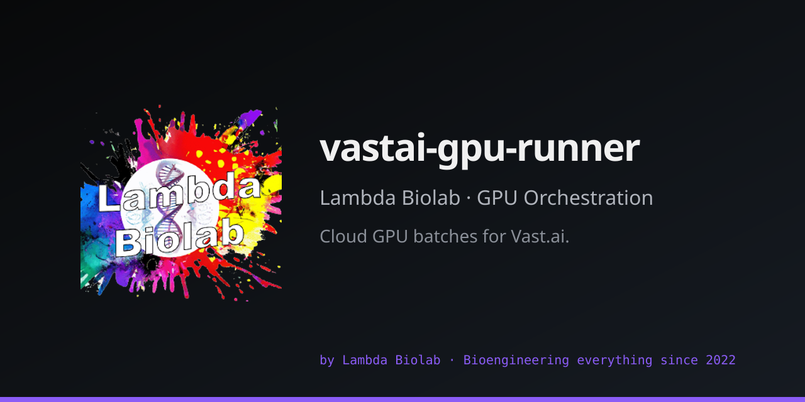

# vastai-gpu-runner

[](pyproject.toml)
[](LICENSE)
[](https://www.python.org/)
[](https://github.com/Lambda-Biolab/vastai-gpu-runner/actions/workflows/ci.yml)
[](https://codecov.io/gh/Lambda-Biolab/vastai-gpu-runner)
[](https://github.com/Lambda-Biolab/vastai-gpu-runner/actions/workflows/dependabot/dependabot-updates)
[](https://github.com/Lambda-Biolab/vastai-gpu-runner/actions/workflows/codeql.yml)
[](https://www.codefactor.io/repository/github/lambda-biolab/vastai-gpu-runner)



Cloud GPU orchestration framework for [Vast.ai](https://vast.ai) — batch deployment, R2 storage, worker lifecycle, crash recovery.

## Features

- **CloudRunner** — provider-agnostic lifecycle with retry and machine deduplication
- **VastaiRunner** — hardened Vast.ai deployment with quality filters and ownership guards
- **R2Sink** — S3-compatible result storage with DONE markers and parallel downloads
- **BaseWorker** — template method worker: GPU check, preflight gates, self-destruct
- **BatchState** — atomic JSON persistence for crash-recoverable batch orchestration
- **Cost estimator** — GPU speed factors, live pricing, scaling tables
- **CLI** — credential checks, instance listing, cost estimation, orphan cleanup

## Installation

```bash
uv add "vastai-gpu-runner @ git+https://github.com/antomicblitz/vastai-gpu-runner.git"
```

Requires Python >= 3.11, `vastai` CLI (`pip install vastai`), and R2 credentials in `~/.cloud-credentials`.

## Quick start

```python
from vastai_gpu_runner.providers.vastai import VastaiRunner
from vastai_gpu_runner.types import DeploymentConfig

runner = VastaiRunner(
    DeploymentConfig(gpu_model="RTX_4090", max_cost_per_hour=0.35),
    docker_image="my-org/my-image:latest",
    allowed_images=frozenset({"my-org/my-image:latest"}),
)

result = runner.run_full_cycle(
    files={"worker.sh": script_path, "input.tar": data_path},
    local_output_dir=output_path,
    max_retries=3,
)
```

See [docs/guide.md](docs/guide.md) for workers, batch state, R2 storage, and cost estimation examples.

## CLI

```bash
vastai-gpu-runner check                  # Verify Vast.ai + R2 credentials
vastai-gpu-runner instances              # List active instances
vastai-gpu-runner estimate -w 10         # Scaling table for 10h of GPU work
vastai-gpu-runner cleanup -l "myproject" # Destroy orphaned instances
```

## Architecture

```
vastai_gpu_runner/
    types.py              # Enums and dataclasses
    runner.py             # CloudRunner ABC
    ssh.py                # SSH/SCP utilities
    state.py              # Batch + job state persistence
    orchestrator.py       # Zombie sweep, detach, budget
    cli.py                # CLI entry point
    providers/vastai.py   # Vast.ai implementation
    storage/r2.py         # R2/S3 result storage
    worker/base.py        # BaseWorker template method
    worker/health.py      # GPU + R2 health checks
    estimator/core.py     # Scaling tables, GPU speed factors
    estimator/pricing.py  # Live Vast.ai pricing
```

See [docs/architecture.md](docs/architecture.md) for design decisions.

## Documentation

- [User guide](docs/guide.md) — deployment, workers, state, storage, estimation
- [Extending](docs/extending.md) — adding providers, custom storage, worker examples
- [API reference](docs/api.md) — all classes, methods, and parameters
- [Architecture](docs/architecture.md) — module layout and design decisions
- [Changelog](CHANGELOG.md)

## Development

```bash
git clone https://github.com/antomicblitz/vastai-gpu-runner.git
cd vastai-gpu-runner
uv sync
uv run pytest          # 68 tests
uv run ruff check src/ # linting
uv run pyright src/    # type checking
```

### CI / Codecov setup (one-time, repo admin)

The CI workflow uploads coverage to Codecov and the codecov badge
is rendered in the README. Two admin actions are required after
the first merge to `main` to make the badge transition from
"unknown" to a real percentage:

1. **Activate Codecov** at <https://codecov.io/gh/Lambda-Biolab/vastai-gpu-runner>
   (click "Activate"). The project configuration in
   [`codecov.yml`](codecov.yml) is picked up automatically.
2. **Add the Codecov upload token** as a repository secret named
   `CODECOV_TOKEN`. Codecov's documented tokenless-upload flow
   uses OIDC for *PRs from forks* to public repos, but direct
   pushes to the protected `main` branch always require a token
   unless the Codecov org setting "Global Upload Token" is
   enabled (which grants tokenless uploads for *all* branches).
   The per-repository upload token is printed on the Codecov
   project page under "Settings → Tokens".

Without these two steps the Codecov badge will stay at "unknown"
and the `Upload coverage to Codecov` step in `ci.yml` will fail
with `"Token required because branch is protected"`.

## License

Apache 2.0 — see [`LICENSE`](LICENSE).
